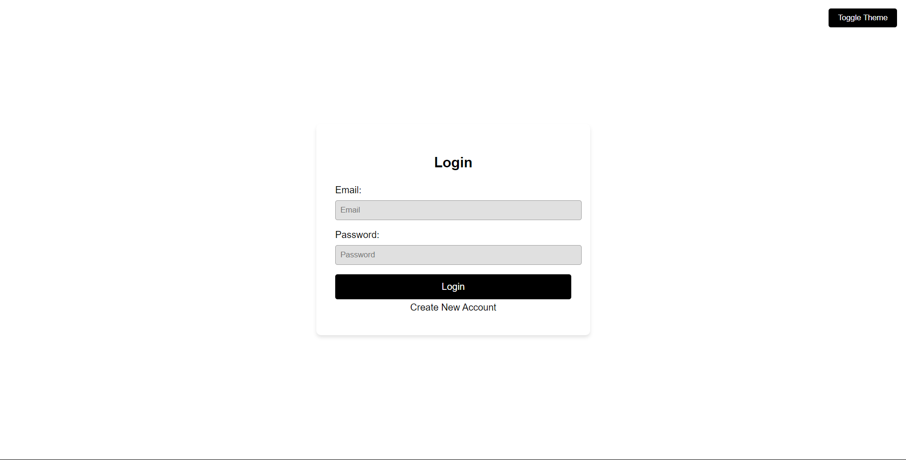
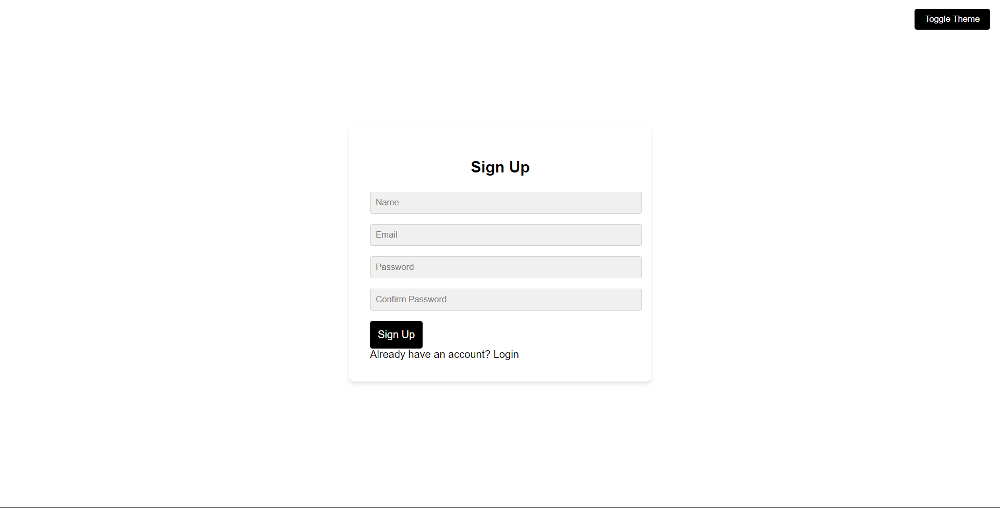
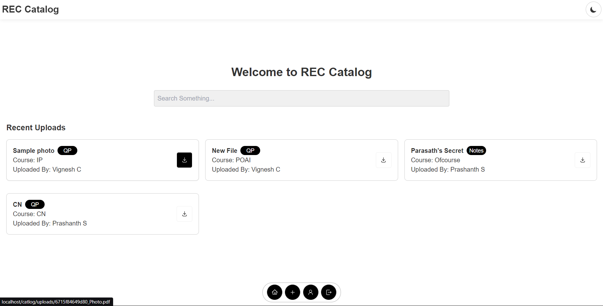
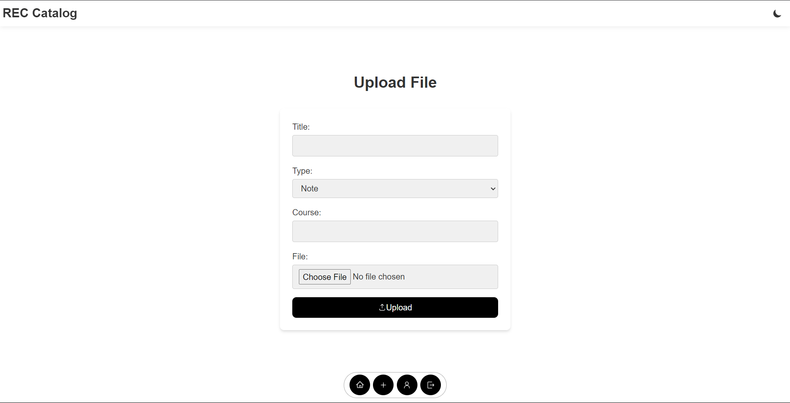
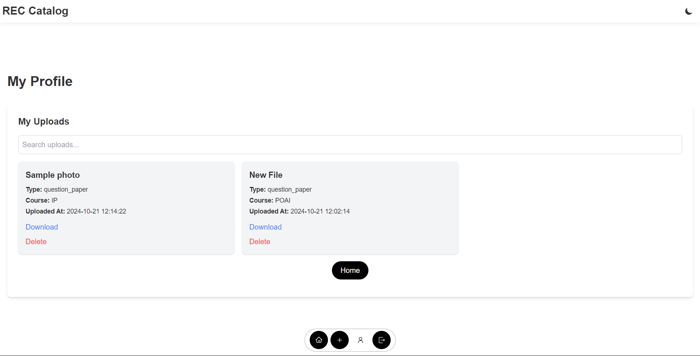

# 📚 REC Catlog

**REC Catlog** is a web application for students to upload and share their study materials and previous exam question papers. This project allows students to access and upload notes and question papers, making it easy to collaborate and contribute to a shared repository of academic resources.

## Features

- **User Registration and Login**: Students can create an account, log in, and manage their profile.
- **Upload Notes**: Students can upload their class notes in PDF format for others to access.
- **Upload Exam Question Papers**: Previous exam papers can be uploaded for future reference.
- **Download Resources**: Students can download uploaded notes and question papers.
- **Search and Filter**: Easily search for specific notes or papers by subjects or tags.
- **Secure Authentication**: Passwords are hashed and stored securely in the database.
  
## Technologies Used

- **Frontend**: HTML, CSS, JavaScript
- **Backend**: PHP, MySQL
- **Database**: MySQL

## Installation

To run this project locally, follow these steps:

### Prerequisites

- **PHP** >= 7.4
- **MySQL**
- **Git**

### Steps

1. **Clone the Repository**:

   ```bash
   git clone https://github.com/Alien501/CS19542-Internet-Programming-Lab
   ```

2. **Set Up the Database**:

   - Create a new MySQL database:
     ```sql
     CREATE DATABASE catlog;
     ```
   - Import the database schema from the `database/rec_catlog.sql` file:
     ```bash
     mysql -u your_username -p rec_catlog < database/catlog.sql
     ```

3. **Configure the Database Connection**:

   Open the `config/database.php` file and configure it with your database details:

   ```php
   <?php
   $host = 'localhost';
   $db = 'catlog';
   $user = 'your_username';
   $pass = 'your_password';

   $pdo = new PDO("mysql:host=$host;dbname=$db", $user, $pass);
   $pdo->setAttribute(PDO::ATTR_ERRMODE, PDO::ERRMODE_EXCEPTION);
   ?>
   ```

4. **Run the Project**:

   - Move the project to your web server's root directory or start a local PHP server using:
     ```bash
     php -S localhost:8000
     ```

   - Visit `http://localhost/catlog/pages` (or `http://localhost:8000` if using PHP's built-in server).

5. **Create an Admin Account** (Optional):

   You can create an initial admin/student account by manually inserting into the `students` table or using the signup feature.

## Usage

1. **Sign Up**: Register as a student to start uploading notes and exam question papers.
2. **Log In**: Log in with your credentials to access the dashboard and manage your uploads.
3. **Upload Notes**: Navigate to the "Upload" section to submit your notes and exam papers.
4. **Download Notes**: Browse and download materials shared by other students.

## Screenshots

<!-- Include screenshots here, for example: -->







## Contributing

If you'd like to contribute to the project:

1. Fork the repository.
2. Create a new feature branch (`git checkout -b feature-name`).
3. Make your changes.
4. Push to the branch (`git push origin feature-name`).
5. Create a pull request.

## License

This project is licensed under the MIT License. See the [LICENSE](LICENSE) file for details.

## Contact

If you have any questions or suggestions, feel free to reach out!

- **Your Name** - [cvignesh404@gmail.com](mailto:cvignesh404@gmail.com)
- **GitHub**: [Alien501](https://github.com/Alien501)
  